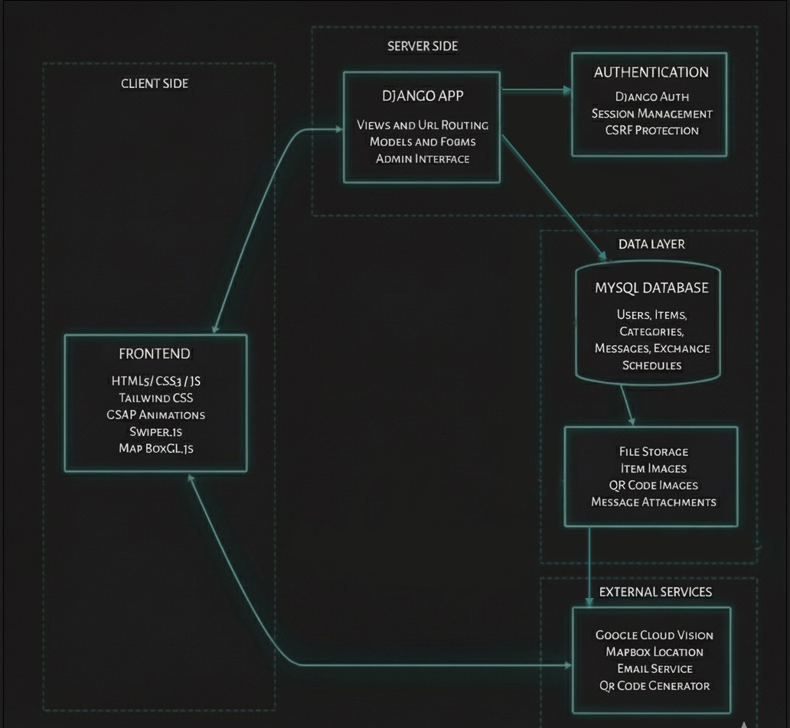

# WasteNot

WasteNot is a full-stack web application that facilitates community-based item sharing and waste reduction. The platform enables users to give away items they no longer need, helping reduce landfill waste while fostering community connections.


## Features

### User Management
- **User registration and authentication**: Users can easily create new accounts and securely log in to access personalized features. The system supports robust authentication mechanisms to protect user data.
- **Personalized user dashboard**: Each user gets a dedicated dashboard to manage their posted items, view exchange history, track messages, and update their profile settings.
- **Profile management**: Users can update their personal information, contact details, and preferences, ensuring their profile accurately reflects their current status.

### Item Management
- **Post items with multiple images**: Users can list items they wish to give away, including the ability to upload multiple images to provide a comprehensive visual representation of the item's condition.
- **Automatic item condition analysis using Google Cloud Vision API**: Leveraging the Google Cloud Vision API, the platform automatically analyzes uploaded item images to assess their condition, providing objective insights to potential recipients.
- **QR code generation for item pickup verification**: For each posted item, a unique QR code is generated. This QR code serves as a secure verification method for item pickups, ensuring that only the intended recipient can claim the item.
- **Browse available items with search and filtering**: Users can easily discover items through a comprehensive browsing interface, enhanced with powerful search capabilities and various filtering options (e.g., category, condition, distance).
- **Location-based item discovery**: Integrated with mapping services, users can find items available in their vicinity or within a specified radius, making local exchanges convenient and efficient.

### Communication
- **In-app messaging system between users**: A secure and intuitive in-app messaging system allows users to communicate directly with each other regarding items, exchange details, and any other relevant inquiries.
- **Email notifications for new messages**: Users receive real-time email notifications for new messages, ensuring they stay informed and can respond promptly to inquiries.
- **File attachment support in messages**: The messaging system supports file attachments, enabling users to share additional images, documents, or other relevant files during their conversations.

### Exchange Management
- **Schedule item pickups**: Users can coordinate and schedule convenient pickup times and locations for items they wish to exchange, streamlining the handover process.
- **Confirm exchanges using QR codes**: Upon pickup, both parties can use the generated QR code to confirm the exchange, providing a secure and verifiable record of the transaction.
- **Exchange history tracking**: The platform maintains a detailed history of all past exchanges, allowing users to review their giving and receiving activities.
- **Real-time status updates**: Users receive real-time updates on the status of their exchanges, from initial scheduling to successful completion, ensuring transparency and clarity throughout the process.

### Location Services
- **Interactive map interface**: An interactive map interface allows users to visually explore available items based on their geographical location, enhancing the discovery experience.
- **Automatic geolocation detection**: The application can automatically detect the user's current location, providing a personalized and relevant item browsing experience.
- **Custom location input**: Users have the flexibility to manually input custom locations, allowing them to search for items in areas beyond their current geolocation.

## Architectural Diagram




## Tech Stack

### Frontend
- **HTML5/CSS3**


- **JavaScript**


- **Tailwind CSS**


- **GSAP Animations**


- **MapBox for mapping**


- **Swiper.js for carousels**


### Backend
- **Django**


- **MySQL Database**


- **Python**

### APIs and Services
- **Google Cloud Vision API for image analysis**


- **MapBox API for location services**


- **QR Code generation**


- **Email service integration**


### Authentication
- **Django Authentication System**


- **Session-based authentication**


- **Password reset functionality**


## Security Features
- **CSRF protection**


- **Secure password handling**


- **Protected user data**


- **Secure file uploads**


## Requirements
- **Python 3.x**


- **Django 4.2+**


- **MySQL**


- **Google Cloud Vision API credentials**


- **MapBox API key**


## Project Structure

``` sh
wastenot/
├── wastenot_backend/
│   ├── core/
│   │   ├── migrations/
│   │   ├── static/
│   │   ├── templates/
│   ├── static/
│   │   ├── css/
│   │   ├── images/
│   │   └── js/
│   ├── templates/
│   │   ├── messages/
│   │   └── registration/
│   ├── wastenot_backend/
│   │   ├── __init__.py
│   │   ├── asgi.py
│   │   ├── settings.py
│   │   ├── urls.py
│   │   └── wsgi.py
│   ├── .gitignore
│   ├── manage.py
│   └── requirements.txt
├── .env
├── .gitignore
├── gcloud-key.json
├── key.py
├── README.md
└── w1.html

```

## Installation

1.  **Clone the repository**: Begin by cloning the WasteNot project repository to your local machine using Git.
    ```sh
    git clone https://github.com/your-username/wastenot.git
    cd wastenot
    ```
2.  **Install dependencies**: Navigate to the `wastenot_backend` directory and install all required Python packages using pip.
    ```sh
    cd wastenot_backend
    pip install -r requirements.txt
    ```
3.  **Configure environment variables**: Create a `.env` file in the `wastenot_backend` directory based on the `.env.example` file. Populate it with your database credentials, Google Cloud Vision API key, MapBox API key, and email service configurations.

``` sh

DB_ENGINE=django.db.backends.mysql
DB_NAME=your_database_name
DB_USER=your_database_user
DB_PASSWORD=your_database_password
DB_HOST=your_database_host
DB_PORT=3306

SECRET_KEY=your_secret_key_here
DEBUG=False
 ``` 
 
4.  **Set up the database**: Apply database migrations to create the necessary tables and schema in your MySQL database.
    ```sh
    python manage.py migrate
    ```
5.  **Run the development server**: Start the Django development server to access the application locally.
    ```sh
    python manage.py runserver
    ```

## Contributing

For contributions, please submit a pull request to the `main` branch. Ensure your code adheres to the project's established coding standards, includes comprehensive tests for new features or bug fixes, and passes all existing tests. Detailed guidelines for contributing can be found in `CONTRIBUTING.md` (if available).
