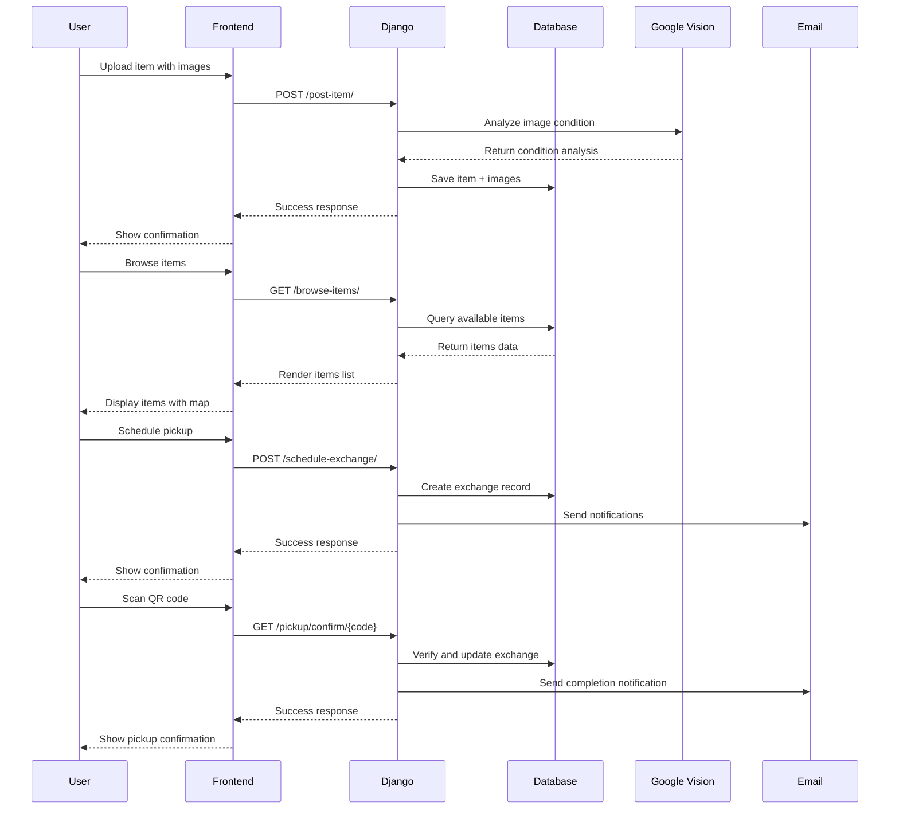

# WasteNot Application Architecture Diagram

## System Overview
WasteNot is a full-stack Django web application that facilitates community-based item sharing and waste reduction. The platform enables users to give away items they no longer need, helping reduce landfill waste while fostering community connections.

## Architecture Diagram

```mermaid
graph TB
    %% User Interface Layer
    subgraph "Frontend Layer"
        UI[Web Browser Interface]
        subgraph "Frontend Technologies"
            HTML[HTML5/CSS3]
            JS[JavaScript]
            TW[Tailwind CSS]
            GSAP[GSAP Animations]
            SWIPER[Swiper.js Carousels]
            LEAFLET[Leaflet Maps]
        end
    end

    %% Application Layer
    subgraph "Django Application Layer"
        subgraph "Django Backend"
            DJANGO[Django Framework]
            DRF[Django REST Framework]
            CORS[CORS Headers]
            WIDGETS[Widget Tweaks]
        end
        
        subgraph "Core Application"
            VIEWS[Views Layer]
            MODELS[Models Layer]
            URLS[URL Routing]
            FORMS[Forms]
            SERIALIZERS[DRF Serializers]
            TEMPLATES[Django Templates]
        end
        
        subgraph "Authentication & Security"
            AUTH[Django Auth System]
            SESSION[Session Management]
            CSRF[CSRF Protection]
            PERMS[Permissions]
        end
    end

    %% Data Models
    subgraph "Data Models"
        USER[User Model]
        ITEM[Item Model]
        CATEGORY[Category Model]
        ITEMIMAGE[ItemImage Model]
        EXCHANGE[ExchangeSchedule Model]
        MESSAGE[Message Model]
    end

    %% External Services
    subgraph "External APIs & Services"
        GCV[Google Cloud Vision API]
        MAPBOX[MapBox API]
        OSM[OpenStreetMap/Nominatim]
        EMAIL[Email Service]
        QR[QR Code Generation]
    end

    %% Database Layer
    subgraph "Database Layer"
        MYSQL[(MySQL Database)]
        MEDIA[Media Storage]
        STATIC[Static Files]
    end

    %% Infrastructure
    subgraph "Infrastructure"
        WSGI[WSGI Server]
        VENV[Virtual Environment]
        ENV[Environment Variables]
    end

    %% Connections
    UI --> DJANGO
    HTML --> UI
    JS --> UI
    TW --> UI
    GSAP --> UI
    SWIPER --> UI
    LEAFLET --> UI
    
    DJANGO --> VIEWS
    DJANGO --> MODELS
    DJANGO --> URLS
    DJANGO --> AUTH
    
    VIEWS --> MODELS
    VIEWS --> FORMS
    VIEWS --> SERIALIZERS
    VIEWS --> TEMPLATES
    
    MODELS --> USER
    MODELS --> ITEM
    MODELS --> CATEGORY
    MODELS --> ITEMIMAGE
    MODELS --> EXCHANGE
    MODELS --> MESSAGE
    
    MODELS --> MYSQL
    VIEWS --> MEDIA
    DJANGO --> STATIC
    
    VIEWS --> GCV
    UI --> MAPBOX
    UI --> OSM
    VIEWS --> EMAIL
    MODELS --> QR
    
    DJANGO --> WSGI
    DJANGO --> ENV
    
    %% Styling
    classDef frontend fill:#e1f5fe
    classDef backend fill:#f3e5f5
    classDef database fill:#e8f5e8
    classDef external fill:#fff3e0
    classDef infrastructure fill:#fce4ec
    
    class UI,HTML,JS,TW,GSAP,SWIPER,LEAFLET frontend
    class DJANGO,DRF,CORS,WIDGETS,VIEWS,MODELS,URLS,FORMS,SERIALIZERS,TEMPLATES,AUTH,SESSION,CSRF,PERMS backend
    class MYSQL,MEDIA,STATIC,USER,ITEM,CATEGORY,ITEMIMAGE,EXCHANGE,MESSAGE database
    class GCV,MAPBOX,OSM,EMAIL,QR external
    class WSGI,VENV,ENV infrastructure
```

## Component Details

### 1. Frontend Layer
- **HTML5/CSS3**: Modern web standards for structure and styling
- **JavaScript**: Client-side functionality and API interactions
- **Tailwind CSS**: Utility-first CSS framework for responsive design
- **GSAP Animations**: Advanced animations and transitions
- **Swiper.js**: Touch-enabled carousels for image galleries
- **Leaflet Maps**: Interactive mapping with OpenStreetMap integration

### 2. Django Application Layer
- **Django Framework**: Core web framework (v4.2+)
- **Django REST Framework**: API endpoints for frontend-backend communication
- **CORS Headers**: Cross-origin resource sharing support
- **Widget Tweaks**: Enhanced form rendering

### 3. Core Application Components
- **Views**: Handle HTTP requests and business logic
- **Models**: Data layer with ORM for database interactions
- **URLs**: Route mapping and API endpoints
- **Forms**: User input validation and processing
- **Serializers**: JSON serialization for API responses
- **Templates**: Server-side rendered HTML pages

### 4. Data Models
- **User**: Django's built-in user authentication
- **Item**: Core item sharing functionality
- **Category**: Item categorization system
- **ItemImage**: Multiple image support per item
- **ExchangeSchedule**: Pickup scheduling and coordination
- **Message**: In-app messaging system

### 5. External Integrations
- **Google Cloud Vision API**: Automated item condition analysis
- **MapBox API**: Advanced mapping and location services
- **OpenStreetMap/Nominatim**: Reverse geocoding for addresses
- **Email Service**: Notification system
- **QR Code Generation**: Secure pickup verification

### 6. Database & Storage
- **MySQL**: Primary relational database
- **Media Storage**: User-uploaded images and files
- **Static Files**: CSS, JavaScript, and asset management

## Data Flow Architecture

## API Endpoints

### REST API Endpoints
- `GET/POST /api/items/` - Item management
- `GET/POST /api/categories/` - Category management
- `POST /api/items/create_with_images/` - Item creation with multiple images

### Web Application Routes
- `/` - Home page
- `/register/` - User registration
- `/login/` - User authentication
- `/dashboard/` - User dashboard
- `/post-item/` - Item posting form
- `/browse-items/` - Item discovery
- `/item/{id}/` - Item details
- `/item/{id}/schedule/` - Exchange scheduling
- `/messages/` - Messaging system
- `/item/{id}/qr-code/` - QR code generation
- `/pickup/confirm/{code}/` - QR code verification

## Security Features
- **CSRF Protection**: Cross-site request forgery prevention
- **Session Authentication**: Secure user sessions
- **Permission Classes**: Role-based access control
- **Secure File Uploads**: Validated image uploads
- **Password Validation**: Strong password requirements

## Key Features Implementation

### 1. Item Condition Analysis
- Google Cloud Vision API integration
- Automated image analysis for condition assessment
- Label detection, object recognition, and color analysis
- Smart condition scoring algorithm

### 2. Location Services
- Interactive map interface using Leaflet
- Geolocation API for automatic location detection
- OpenStreetMap integration for address lookup
- Location-based item discovery

### 3. QR Code System
- Unique pickup codes for each item
- QR code generation using Python qrcode library
- Secure verification system for exchanges
- Mobile-friendly scanning interface

### 4. Messaging System
- In-app messaging between users
- Email notifications for new messages
- File attachment support
- Message read/unread status tracking

### 5. Exchange Management
- Pickup scheduling system
- Status tracking (pending, confirmed, completed, cancelled)
- Email notifications for status changes
- Exchange history tracking

## Technology Stack Summary

| Layer | Technologies |
|-------|-------------|
| **Frontend** | HTML5, CSS3, JavaScript, Tailwind CSS, GSAP, Swiper.js, Leaflet |
| **Backend** | Django 4.2+, Django REST Framework, Python 3.x |
| **Database** | MySQL |
| **External APIs** | Google Cloud Vision, MapBox, OpenStreetMap |
| **Infrastructure** | WSGI, Virtual Environment, Environment Variables |
| **Security** | Django Auth, CSRF Protection, Session Management |

## Deployment Considerations
- Environment variable management for API keys
- Static file serving configuration
- Media file storage and serving
- Database connection pooling
- WSGI server configuration (Gunicorn/uWSGI)
- Reverse proxy setup (Nginx)
- SSL/TLS certificate management

This architecture provides a scalable, secure, and feature-rich platform for community-based item sharing with modern web technologies and best practices.
