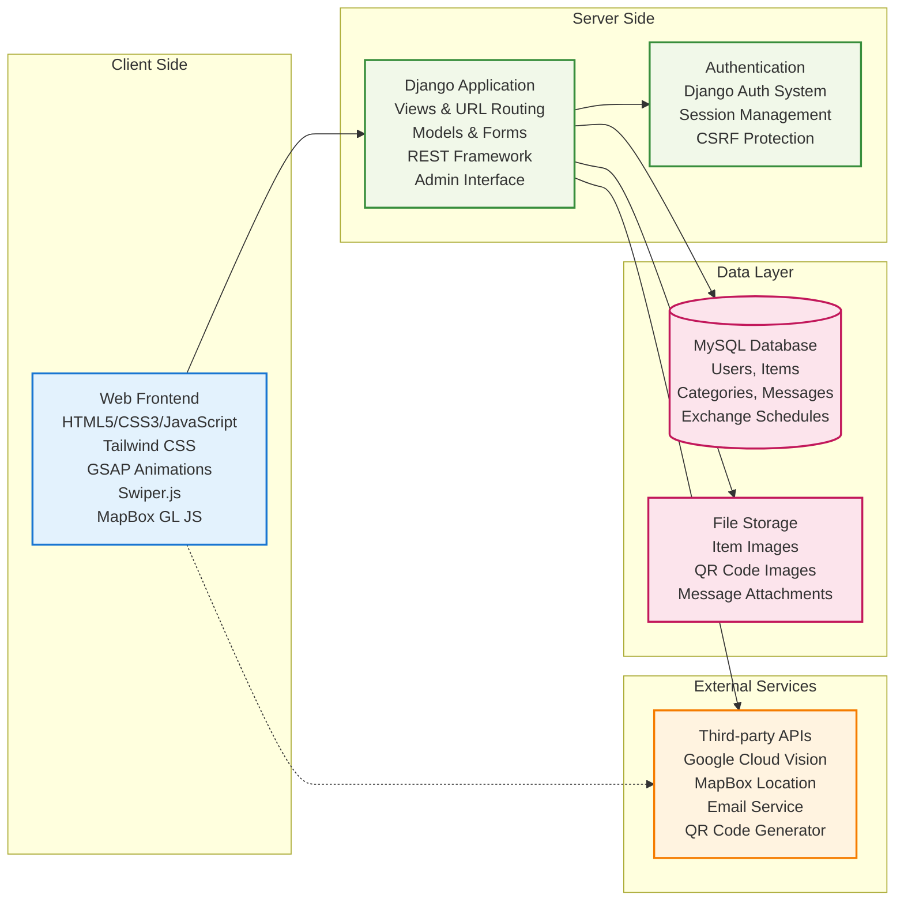
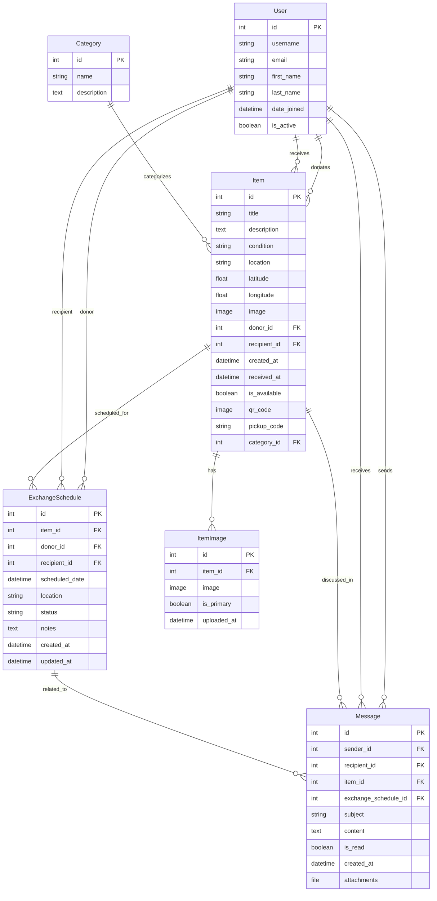
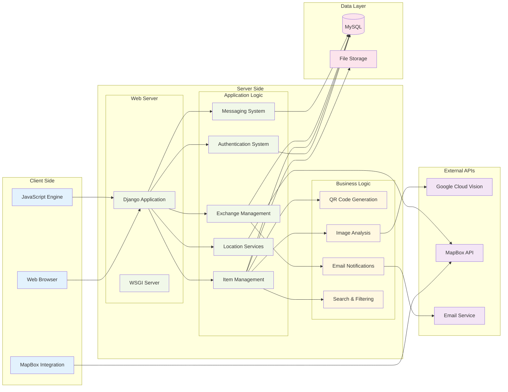
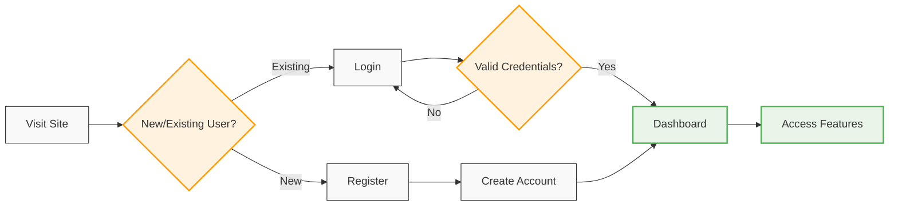
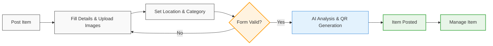
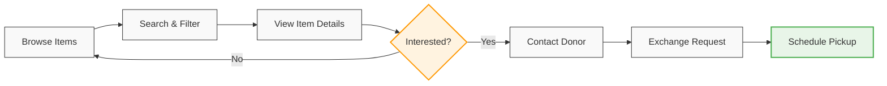
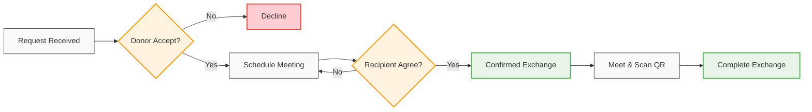
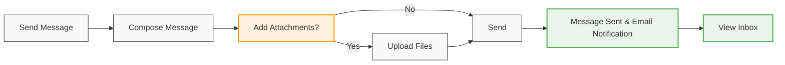
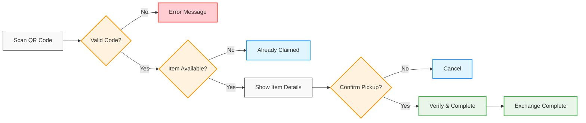
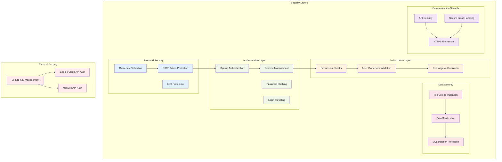

# WasteNot - System Architecture & User Flows

## High-Level System Architecture



## Data Model Architecture



## System Component Architecture



## User Flow Diagrams

### 1. User Registration & Authentication Flow



### 2. Item Posting Flow



### 3. Item Discovery & Request Flow



### 4. Exchange Scheduling & Completion Flow



### 5. Messaging System Flow



### 6. QR Code Verification Flow



## Security Architecture



## Technology Stack Overview

```mermaid
graph LR
    subgraph "Frontend Technologies"
        HTML[HTML5]
        CSS[CSS3 + Tailwind]
        JS[JavaScript ES6+]
        GSAP[GSAP Animations]
        SWIPER[Swiper.js]
        MAPBOX_JS[MapBox GL JS]
    end

    subgraph "Backend Technologies"
        PYTHON[Python 3.x]
        DJANGO[Django 4.2+]
        DRF[Django REST Framework]
        MYSQL[MySQL Database]
    end

    subgraph "External APIs"
        VISION[Google Cloud Vision]
        MAPBOX_API[MapBox API]
        EMAIL_API[Email Service]
    end

    subgraph "Libraries & Tools"
        QR_LIB[QRCode Library]
        PIL[Pillow (PIL)]
        CORS[Django CORS Headers]
        WIDGET[Widget Tweaks]
    end

    subgraph "Development Tools"
        GIT[Git Version Control]
        ENV[Environment Variables]
        VENV[Virtual Environment]
    end

    %% Technology connections
    HTML --> CSS
    CSS --> JS
    JS --> GSAP
    JS --> SWIPER
    JS --> MAPBOX_JS

    PYTHON --> DJANGO
    DJANGO --> DRF
    DJANGO --> MYSQL

    DJANGO --> VISION
    MAPBOX_JS --> MAPBOX_API
    DJANGO --> EMAIL_API

    DJANGO --> QR_LIB
    DJANGO --> PIL
    DJANGO --> CORS
    DJANGO --> WIDGET

    %% Styling
    classDef frontend fill:#e1f5fe
    classDef backend fill:#f3e5f5
    classDef external fill:#fff3e0
    classDef libraries fill:#e8f5e8
    classDef tools fill:#fce4ec

    class HTML,CSS,JS,GSAP,SWIPER,MAPBOX_JS frontend
    class PYTHON,DJANGO,DRF,MYSQL backend
    class VISION,MAPBOX_API,EMAIL_API external
    class QR_LIB,PIL,CORS,WIDGET libraries
    class GIT,ENV,VENV tools
```

## Summary

This comprehensive architecture documentation covers:

1. **High-Level System Architecture** - Shows the overall system structure with frontend, backend, database, and external services
2. **Data Model Architecture** - Entity-relationship diagram showing database structure
3. **System Component Architecture** - Detailed view of system components and their interactions
4. **User Flow Diagrams** - Six key user journeys covering the main application features
5. **Security Architecture** - Security layers and protection mechanisms
6. **Technology Stack Overview** - All technologies used in the project

The WasteNot application is a well-architected Django-based web application that facilitates community item sharing with robust features for user management, item posting, exchange scheduling, messaging, and secure pickup verification through QR codes.
